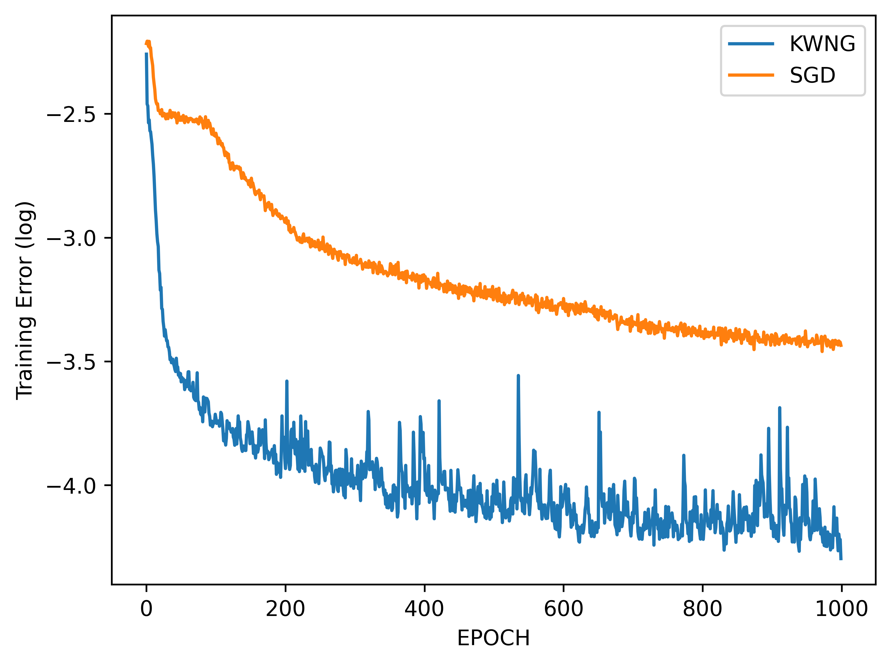

# A subsection of Math 273A Final Project: Natural Gradient Descent, KWNG: Kernelized Wasserstein Natural Gradient Method

[Yadi Cao](https://eydcao.github.io/), [Yunuo Chen](https://www.math.ucla.edu/~yunuoch) and [Xuan Li](https://www.math.ucla.edu/~xuanli1)

In this project, we implemented [Kernelized Wasserstein Natural Gradient](https://openreview.net/forum?id=Hklz71rYvS) and tested on Autoencoder.

